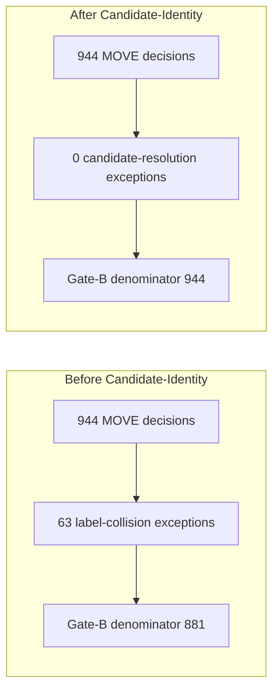

# Accuracy Default-On Decision Note

**Date:** 2026-07-14  
**Status:** IMPLEMENTED — default-on slice landed at `8c54843` (no strength claim)
**Commit basis:** `8c54843` (`feat(accuracy): default-on mode and branch cap 6`)

## The one thing this note is not allowed to bury

> **No default flip happens in this document.**
>
> **No strength or winrate claim follows from this document.**
>
> **No Depth-2 Stage 3 work follows from this document.**
>
> This note records a proposed direction for a later, separate implementation slice. The
> dev-generalization / strength panel should run only after that implementation slice exists and
> has been reviewed.

## Decision summary

The proposed default path is:

| Knob | Current default | Proposed later default | Reason |
|---|---:|---:|---|
| `SHOWDOWN_ACCURACY_MODE` | off | on | Accuracy-aware scoring now has a passing Gate-B result at cap 6 after Candidate-Identity removed the label-resolution exclusions. |
| `SHOWDOWN_ACCURACY_BRANCH_CAP` | 4 | 6 | Cap 6 and cap 8 are identical on Gate-B fidelity, but cap 6 has better latency margin. |

This is a recommendation for the later default-change slice, not the slice itself.

## Evidence base

| Artifact | State | Role |
|---|---|---|
| `main` / `origin/main` | `01f065a` | Candidate-Identity, Gate-B refresh, and documentation updates are on remote `main`. |
| `data/eval/accuracy-gate/gate-b-report.json` | frozen cap 4 result | Authoritative FAIL reference: 114/881 = 12.94%, 63 historical exceptions. Not recomputed. |
| `data/eval/accuracy-cap-derisk/cap6-report.json` | refreshed after Candidate-Identity | PASS: 6/944 = 0.64%, bootstrap upper 1.36%, 0 exceptions. |
| `data/eval/accuracy-cap-derisk/cap8-report.json` | refreshed after Candidate-Identity | PASS: same 6/944 = 0.64%, same bootstrap upper 1.36%, 0 exceptions. |
| `data/eval/accuracy-cap-derisk/latency-results.json` | 2026-07-13 cap sweep | Latency basis for cap 4/6/8, both trace modes, full 944-decision corpus. |
| `data/eval/accuracy-cap-derisk/cross-cap-diffs.json` | 2026-07-13 cap sweep | Cap 4 -> cap 6/8 produced 0/944 action changes; off -> cap 6/8 produced 20/944. |

The cap 6 / cap 8 Gate-B artifacts were re-run after Candidate-Identity on commit `9f64c28` and
committed later as data artifacts. Cap 4 remains the frozen reference from the original offline
gate and was deliberately not re-run.

## What Candidate-Identity changed

Before Candidate-Identity, Gate-B had 944 MOVE decisions but 63 label-resolution exceptions. Those
exceptions came from `_label_ja` collapsing distinct switch targets into the same human-readable
`candidate_id`. The consumer correctly refused to guess, so the compared denominator was 881.

After Candidate-Identity, `CandidateTrace.candidate_key` and `DecisionTrace.chosen_candidate_key`
make the chosen candidate structurally resolvable. The same corpus now compares all 944 MOVE
decisions for cap 6 and cap 8, with 0 exceptions.

The cap-hit numerator did not increase after including the formerly ambiguous decisions:

| Cap | Compared decisions | Exceptions | Cap-hit rate | Verdict |
|---:|---:|---:|---:|---|
| 4 frozen | 881 | 63 historical | 114/881 = 12.94% | FAIL |
| 6 | 944 | 0 | 6/944 = 0.64% | PASS |
| 8 | 944 | 0 | 6/944 = 0.64% | PASS |

The cap 6 and cap 8 bootstrap upper bound is 0.0135858586, about 1.36%, still well under the
pinned 5% gate.

## Proposed cap: 6, not 8

Cap 6 and cap 8 are equivalent on the measured Gate-B fidelity axis:

- same numerator: 6
- same denominator: 944
- same point estimate: 0.64%
- same bootstrap upper bound: about 1.36%
- same action-change count vs accuracy-off: 20/944
- same result that cap 4 -> cap 6/8 changes 0/944 chosen actions on this corpus

Cap 8 therefore buys no measured fidelity on this corpus. It only spends additional latency margin.

| Series | p95 (ms) | p95 x5 | Margin vs 1000ms gate |
|---|---:|---:|---:|
| cap6_trace_none | 173.0 | 865.2 | 13.5% |
| cap6_trace_enabled | 183.9 | 919.4 | 8.1% |
| cap8_trace_none | 179.0 | 894.8 | 10.5% |
| cap8_trace_enabled | 193.6 | 968.2 | 3.2% |

**Recommendation:** use `SHOWDOWN_ACCURACY_BRANCH_CAP=6` for the later default-change slice.
Cap 6 preserves the same measured fidelity as cap 8 while keeping a materially better latency
margin.

## Latency judgment

For the production hot path, the relevant proxy is `cap6_trace_none`.

The Candidate-Identity slice adds structural keys in trace population. In `decision.py`, the key
population happens inside the trace block: `candidate_key=joint_action_key(ja)`,
`trace.chosen_candidate_key = joint_action_key(pre_tera_ja)`, and
`trace.chosen_tera_slot = derive_tera_slot(...)`. A production call without `DecisionTrace` does
not pay that trace-population cost.

That makes the existing `cap6_trace_none` latency result sufficient for this decision note:

- p95 = 173.0ms on the real 944-decision corpus
- p95 x5 = 865.2ms under the existing Kaggle scaling convention
- margin = 13.5% under the 1000ms gate

A trace-enabled latency recheck is optional and lower priority. It becomes important only if the
production path later enables `DecisionTrace` during live play. A full cap 4/6/8 x trace sweep is
not required before writing this decision note.

This judgment does not erase the earlier single-board latency warning. The earlier
accuracy-hit-probability benchmark intentionally used a board that stressed simultaneous accuracy
branching harder than the average real-corpus decision. It remains useful worst-case evidence. The
real-corpus cap sweep is the better basis for this default proposal, and cap 6 is chosen partly
because cap 8's trace-enabled margin is thin.

## Later implementation slice

The later default-change slice should be small and explicit:

| Area | Current code | Proposed change |
|---|---|---|
| `_accuracy_mode()` | unset / `""` / `"0"` / `"false"` -> off | unset -> on; explicit `"0"` / `"false"` remain off. |
| `_accuracy_branch_cap()` | unset -> `4` | unset -> `6` |
| Tests | accuracy parser / config hash / off-path equivalence | update parser expectations, config hash behavior, and explicit-off byte-identity tests. |
| Docs | default-off language | update only after code and tests land. |

The slice should not make a strength claim. The expected observed action effect remains the already
measured accuracy-off vs cap 6 difference: 20/944 chosen-action changes on the replay corpus, with
0 Tera flips in the cap-derisk study.

## Go / no-go checklist before default flip

1. User reviews and approves this decision note.
2. Cap 6 Gate-B PASS at 944 decisions and 0 exceptions is accepted as the gating evidence.
3. Cap 4 remains the frozen FAIL reference and is not retroactively recomputed.
4. The `cap6_trace_none` latency margin is accepted as sufficient for the production proxy.
5. A separate implementation slice changes the defaults and updates tests.
6. Only after that slice: run strength / dev-panel measurement.

## Explicit non-goals

- No edit to `_accuracy_mode()` or `_accuracy_branch_cap()` in this note.
- No new latency sweep in this note.
- No change to `data/eval/accuracy-gate/gate-b-report.json`.
- No commit of local `AGENTS.md`, `CLAUDE.md`, `_gate-b-rerun-2026-07-14.log`, or the local
  `_pre-rerun-2026-07-14-candidate-identity/` archive.
- No new file under `docs/projects/accuracy/specs/`.

## Implementation (2026-07-14)

| Item | Detail |
|------|--------|
| Code commit | `8c54843` — `feat(accuracy): default-on mode and branch cap 6` |
| Spec | `docs/projects/accuracy/specs/2026-07-14-accuracy-default-on-design.md` |
| Parser | unset → accuracy on, branch cap 6; `"0"` / `"false"` / `""` → off |
| Tests | focused spec run 109 passed; full suite 1788 passed (1 skipped, 1 xfailed) |
| Strength claim | **none** — checklist item 6 (dev/strength panel) remains open |

Go/no-go checklist items 1–5 are satisfied. Item 6 (strength / dev-panel measurement) is the
explicit next step and was not part of the implementation slice.

## Proposed next step

Run the dev-generalization / strength panel under the new default-on configuration (explicit
opt-out still available via `SHOWDOWN_ACCURACY_MODE=0`). No strength claim until that measurement
exists and is reviewed.
