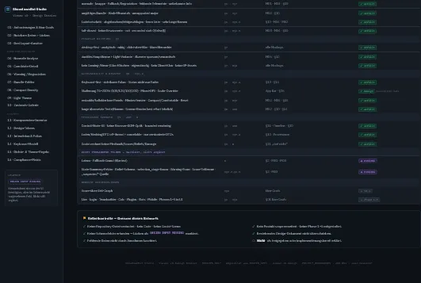

# Viewer v0 mockup dossier

**Status:** accepted design input; not an implementation plan

**Frozen:** 2026-07-16

This directory preserves the user-supplied ShowdownBot Studio Viewer v0 mockup package as a
reviewable design artifact. The HTML, print view, support script, and thumbnail are frozen source
material. Product requirements remain authoritative in
[`../../specs/viewer-v0-design.md`](../../specs/viewer-v0-design.md),
[`../../MASTER_SPEC.md`](../../MASTER_SPEC.md), and
[`../../architecture/PROJECT_BOUNDARIES.md`](../../architecture/PROJECT_BOUNDARIES.md).

## Contents

| File | Purpose |
|---|---|
| [`viewer-v0-design-dossier.html`](viewer-v0-design-dossier.html) | Interactive design dossier with six desktop mockups, state gallery, component inventory, tokens, keyboard model, and compliance matrix |
| [`viewer-v0-design-dossier-print.html`](viewer-v0-design-dossier-print.html) | Print-oriented rendering of the same dossier |
| [`support.js`](support.js) | Runtime helper required by the two preserved HTML artifacts |
| [`thumbnail.webp`](thumbnail.webp) | Package preview supplied with the dossier |

The HTML files are reference artifacts, not Studio runtime code. They must not be imported into the
Godot application or treated as an implementation template.

## Review verdict

The dossier is accepted as the visual direction for the Phase 0 analysis workbench. Its strongest
decisions align with the approved product boundaries:

- one offline replay and DecisionTrace bundle at a time;
- an abstract, sprite-independent doubles board;
- explicit `known`, `suspected`, `unknown`, and `not recorded` information states;
- structural candidate identity instead of table-position identity;
- prominent fail-closed, degradation, and missing-data states;
- a dense but resizable analysis workbench instead of a Showdown-client clone;
- keyboard-first navigation, bounded rendering, compact/comfortable density, and dark/light themes.

The dossier does not authorize implementation and does not resolve missing exporter or schema
contracts. Those remain separate design inputs.

## Binding corrections before implementation

### 1. Offline fonts

The preserved HTML references IBM Plex through Google Fonts. That is acceptable only for this
external mockup artifact. The Studio application must not make that network request. A future
implementation must either bundle a reviewed, license-compliant local font with its notices or use
an approved system-font stack. The Viewer v0 offline guarantee remains unchanged.

### 2. Platform-aware shortcuts

The mockups primarily display macOS-style shortcut labels such as `Cmd+O`. The initial desktop
target is Windows. Shortcut presentation must therefore come from a platform-aware label layer:
`Ctrl` on Windows/Linux and `Cmd` on macOS. The underlying actions and keyboard-first navigation
remain the same.

### 3. Missing data contracts

**Corrected 2026-07-16 against the real producers.** This list originally named seven gaps. A code
audit found that three of them are not gaps — the fields are recorded today — and that only their
*structure* or *vocabulary* is undefined. The authority is
[`../../specs/viewer-v0-bundle-contract-design.md`](../../specs/viewer-v0-bundle-contract-design.md)
§2.7(a) and §10.2.

Genuinely absent — no producer writes them, so they remain DESIGN INPUT MISSING:

- warning object shape and severity vocabulary (no per-decision warning producer exists);
- belief snapshot schema and the source of `suspected` information;
- score components beyond `aggregate_score` (`score_vector` and `OutcomeBreakdown` exist in memory
  only and never reach the trace row);
- state-summary fields not already represented by an approved DTO;
- aggregation mode, `risk_lambda`, and `must_react_lambda` (carried in memory, not persisted).

Recorded today — the field exists, and only its shape or vocabulary is open:

- **decision latency** — `decision_latency_ms` is a *required*, finite-validated field on every trace
  row. It is not a placeholder;
- **fallback reason** — `fallback_reason` is persisted as a nullable string with real recorded
  values. What is missing is a *structured* object, not the field;
- **`selection_stage`** — persisted as a nullable string with real recorded values. What is missing
  is a *closed, validated vocabulary*; the trace validator enum-checks only `decision_phase`, so a
  viewer must render an unrecognized value verbatim rather than mapping it to `unknown`.

Godot must show `not recorded` or a degraded state when a value is genuinely absent. It must not
infer anything from `config_hash`, synthesize defaults, or copy the illustrative values from the
mockup.

## Errata — statements superseded in the frozen dossier

The dossier HTML is **preserved unedited** as the design input it was. Its bytes and the pinned
SHA-256 values below are unchanged, and nothing in this section has been applied to those files.
These entries record where the frozen artifact's text is no longer the binding rule and what
replaced it. Read the dossier as a historical design input; read
[`../../specs/viewer-v0-bundle-contract-design.md`](../../specs/viewer-v0-bundle-contract-design.md)
for the rule in force.

| Location in dossier | Historical statement | Binding rule today | Authority |
|---|---|---|---|
| `viewer-v0-design-dossier.html:239` | "Rang = abgeleitete Sortierposition, kein gespeichertes Feld." | `rank` **is** a recorded field: stored on `CandidateTrace` and persisted in every trace row. The claim holds for the separate `agg-trace-v1` schema, not for the trace row. Candidate sorting may reorder rows for display but never rewrites `rank` or the recorded selection. | [bundle contract](../../specs/viewer-v0-bundle-contract-design.md) §2.7(c), §10.2 |
| `viewer-v0-design-dossier.html` — the `LATENCY` degradation chip | Latency is drawn as an unavailable/degraded placeholder. | `decision_latency_ms` is recorded on every trace row and is **mandatory** in the bundle. It is not a degraded value. | [bundle contract](../../specs/viewer-v0-bundle-contract-design.md) §2.7(a), §10.2 |

No other dossier statement is superseded. The remaining design directions — the abstract
sprite-free board, the four information states, structural candidate identity, fail-closed and
degradation prominence, bounded rendering, and keyboard-first navigation — remain the accepted
visual direction.

## Additional implementation clarification

Candidate sorting and filtering may change presentation order, but never recorded identity or the
chosen candidate. The chosen row is always resolved by structural `candidate_key`; no sort mode may
rewrite or reinterpret the recorded selection.

## Provenance

The source archive was supplied by the user as `ShowdownBot mockups.zip`. Files were extracted and
renamed only for stable repository paths; their bytes were not edited.

| Artifact | SHA-256 |
|---|---|
| Source archive `ShowdownBot mockups.zip` | `63c7babd5305c4e3d9b834677d477f0518220d2d32bb8b9ff0d48be0a8cc2daf` |
| `viewer-v0-design-dossier.html` | `9270d0ccbf91658d97f1ed3f7be814aa9a2da28ce5436bf3633d7aee38599838` |
| `viewer-v0-design-dossier-print.html` | `2a94de687224d5d0ca67bc65d03fbe2009bfc3d0ac667c7dc882b605e7cb4f19` |
| `support.js` | `ae4f0ac8449655e17cca1e3b179effcb6817a3b0d8dc47f112a9c39c25c39fd7` |
| `thumbnail.webp` | `ea9d5b51414cb9268494cb5a2cfde2e982a16a31eaf9a6d4f6468f6b1e3121cb` |

Opening the preserved HTML may contact Google Fonts. This behavior belongs only to the external
design artifact and is explicitly forbidden for the offline Viewer implementation.
